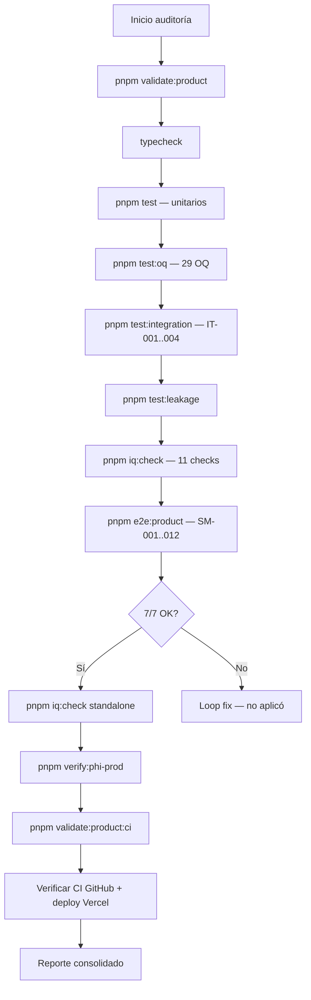

# ALPHI / Ichtys — Reporte Completo de Auditoría y Pruebas

**Fecha de ejecución:** 2026-07-04 15:31 ART (UTC-3)  
**Ejecutor:** Agente automatizado (Cursor)  
**Commit referencia:** `8fdeab9` — `docs(csv): cerrar Fase 0 legal, FMEA, PQ, VSR v1.0`  
**Deploy producción:** `dpl_7aVVX88GFCVrWzRv7EQ5kFjHPvcu`  
**URL prod:** https://asistente-bot-five.vercel.app  
**Base de datos:** Neon `fragrant-sun-79639780` (proyecto Asistente_bot)

---

## 1. Resumen ejecutivo

| Área | Resultado | Detalle |
|------|-----------|---------|
| **Gate unificado** (`validate:product`) | **PASS** | 7/7 OK (~86s) |
| **Gate CI** (`validate:product:ci`) | **PASS** | 4/4 OK, 3 skipped (sin DB) |
| **IQ — Installation Qualification** | **PASS** | 11/11 checks |
| **OQ — Operational Qualification** | **PASS** | 29/29 tests |
| **IT — Integration Tests PHI** | **PASS** | 4/4 tests (Neon real) |
| **E2E product loop** | **PASS** | 12/12 SM evals + checks clínicos |
| **Smoke PHI prod** | **PASS** | create 201 + cleanup OK |
| **GitHub CI (main)** | **PASS** | Run #28715617906 success |
| **Fase 0 legal** | **CERRADA** | DPA/BAA/DPIA/HIPAA 2026-07-04 |
| **PQ piloto CINME** | **PENDIENTE** | Requiere 5 usuarios + UAT manual |
| **VSR firma final** | **PENDIENTE** | Post-PQ |

**Veredicto global:** El sistema está **calificado para IQ/OQ/IT** y **operativo en producción** con evidencia automatizada completa. Go-live con PHI real de pacientes del sitio requiere **PQ PASS + firmas VSR §6**.

---

## 2. Flujo ejecutado (automático)



**Criterio de salida** (según `OPERATIONS.md` §2): 0 fallos en validate + IQ + verify PHI; deployment `READY`.

---

## 3. Detalle por gate

### 3.1 `pnpm validate:product` — 7/7 OK

| Step | ID | Duración | Resultado |
|------|-----|----------|-----------|
| Typecheck | `typecheck` | 1.3s | ✓ |
| Unit / integration tests | `test` | 1.3s | ✓ |
| OQ módulo clínico | `test:oq` | 3.6s | ✓ 29/29 |
| Integration PHI (DB) | `test:integration` | 7.6s | ✓ 4/4 |
| Tenant leakage | `test:leakage` | 1.2s | ✓ |
| IQ env + schema | `iq:check` | 5.1s | ✓ 11/11 |
| E2E product loop | `e2e:product` | 60.5s | ✓ |

### 3.2 Tests unitarios por paquete (dentro de `pnpm test`)

| Paquete | Tests | Estado |
|---------|-------|--------|
| `@ichtys/auth` | 37 | PASS |
| `@ichtys/rag` | 96 | PASS |
| `@ichtys/web` | 181 (incl. IT) | PASS |
| `@ichtys/evals` | 48 | PASS |
| `@ichtys/ingestion` | 25 | PASS |
| `@ichtys/clinical` | 16 | PASS |
| `@ichtys/crypto` | 8 | PASS |
| `@ichtys/db` | 4 | PASS |
| `@ichtys/llm` | 3 | PASS |

> Nota: logs de `[ingestion] FAILED` en tests son **escenarios negativos esperados** (mocks de error); todos los asserts pasan.

### 3.3 OQ — 29 tests (Operational Qualification)

| Archivo | Tests | URS cubiertos |
|---------|-------|---------------|
| `subjects/route.oq.test.ts` | 6 | URS-001, URS-002, URS-008 |
| `evolutions/route.oq.test.ts` | 7 | URS-001, URS-003, URS-004 |
| `profile/route.oq.test.ts` | 4 | URS-003, URS-005 |
| `screening/route.oq.test.ts` | 6 | URS-005, URS-006 |
| `labs/route.oq.test.ts` | 6 | URS-007 |

### 3.4 IT — 4 tests (Integration, Neon real)

| ID | Descripción | Resultado |
|----|-------------|-----------|
| IT-001 | Profile cifrado at-rest (sin plaintext en DB) | PASS |
| IT-002 | loadPatientProfile round-trip decrypt | PASS |
| IT-003 | evaluateAndPersistScreening persiste snapshot | PASS |
| IT-004 | Aislamiento org en loadPatientProfile | PASS |

### 3.5 E2E product loop — evaluación RAG (SM-001..SM-012)

| Caso | Resultado | Duración |
|------|-----------|----------|
| SM-001 | PASS | 5.9s |
| SM-002 | PASS | 6.2s |
| SM-003 | PASS | 7.5s |
| SM-004 | PASS | 4.5s |
| SM-005 | PASS | 5.4s |
| SM-006 | PASS | 7.0s |
| SM-007 | PASS | 15.5s |
| SM-008 | PASS | 8.8s |
| SM-009 | PASS | 9.8s |
| SM-010 | PASS | 21.9s |
| SM-011 | PASS | 4.8s |
| SM-012 | PASS | 6.2s |

**Checks adicionales E2E:**
- Study spec MOCK-METABOLIC presente/aprobado
- Ventana V6 ±7 días @ Day 169
- Screening HbA1c 9% → pass
- Exclusión pancreatitis → fail
- Org RAG config patch/restore
- PHI subject round-trip (create + delete)

### 3.6 IQ — 11/11 OK

| Check | Estado |
|-------|--------|
| PHI_ENCRYPTION_KEY | ✓ present |
| DATABASE_URL | ✓ present |
| CLERK_SECRET_KEY | ✓ present |
| Schema: subjects | ✓ |
| Schema: clinical_evolutions | ✓ |
| Schema: patient_profiles | ✓ |
| Schema: screening_assessments | ✓ |
| Schema: audit_logs | ✓ |
| Schema: organizations | ✓ |
| Organizations seeded | ✓ 1 org |
| Migration rag_config | ✓ |

### 3.7 Smoke PHI producción

```
OK create: 201 2edc877b-08ea-4ea7-8184-511b0d1e9bc0 TEST-PHI-MR6PAOAI
OK cleanup: deleted 2edc877b-08ea-4ea7-8184-511b0d1e9bc0
```

Endpoint: `POST /api/studies/{studyId}/subjects` en prod con JWT Clerk.

### 3.8 Gate CI (`validate:product:ci`)

| Step | Resultado |
|------|-----------|
| Typecheck | ✓ |
| Unit tests | ✓ |
| OQ | ✓ |
| Leakage | ✓ |
| Integration PHI | ○ skip (--ci) |
| IQ | ○ skip (--ci) |
| E2E | ○ skip (--ci) |

**Total: 4/4 OK, 3 skipped** — comportamiento esperado en CI sin secrets DB.

---

## 4. Infraestructura y deploy

| Componente | Valor |
|------------|-------|
| Repo | `Santiagoisper/Asistente_bot` |
| Rama | `main` @ `8fdeab9` |
| CI run | [#28715617906](https://github.com/Santiagoisper/Asistente_bot/actions/runs/28715617906) — **success** (1m14s) |
| Deploy prod | `dpl_7aVVX88GFCVrWzRv7EQ5kFjHPvcu` |
| Alias | https://asistente-bot-five.vercel.app |
| Build | Next.js 15.5.19 — READY |
| Neon project | `fragrant-sun-79639780` |

**Observación CI:** workflow `db-check.yml` reportó failure en el mismo push (0s) — solo aplica a PRs con cambios en `packages/db/**` y requiere secrets; **no bloquea** el gate principal CI.

---

## 5. Estado compliance CSV

| Documento | Versión | Estado |
|-----------|---------|--------|
| Fase 0 legal (README) | — | ✅ CERRADA 2026-07-04 |
| URS | v1.0 | ✅ |
| FRS | v1.0 | ✅ |
| RTM | v1.0 | ✅ |
| FMEA | v1.0 | ✅ |
| CSV-VALIDATION-PLAN | v1.0 | ✅ IQ/OQ/IT completados |
| PQ | v1.0 | 🟡 Protocolo listo — ejecución pendiente |
| VSR | v1.0 borrador | 🟡 Firma post-PQ |
| VALIDATION-DEVIATION-LOG | — | DEV-001..003 cerrados |

---

## 6. PQ — qué queda manual

Los casos PQ-C01..C10 y PQ-R01..R04 requieren **usuarios piloto con sesión Clerk** en el sitio CINME. No son automatizables sin credenciales de los 5 usuarios.

| PQ-ID | Automatizable | Evidencia parcial |
|-------|---------------|-------------------|
| PQ-C01 Login | Manual UI | Clerk middleware activo |
| PQ-C02 Crear sujeto | **Parcial** | `verify:phi-prod` create 201 |
| PQ-C03 Evolución | Manual UI | OQ-003 + IT-001 |
| PQ-C04 Screening | Manual UI | E2E screening engine PASS |
| PQ-C05 No LLM screening | Manual UI | OQ screening 6 tests |
| PQ-C06–C08 Labs OCR | Manual UI | OQ labs 6 tests |
| PQ-C09 Audit | Manual DB review | OQ audit assertions |
| PQ-C10 Aislamiento | Manual 2 orgs | IT-004 + leakage |
| PQ-R01..R04 RAG | **Parcial** | SM-001..012 12/12 PASS |

**Protocolo:** [`docs/compliance/PQ.md`](../compliance/PQ.md)  
**Checklist piloto:** [`docs/evals/pilot-cinme-checklist.md`](../evals/pilot-cinme-checklist.md)

---

## 7. Desviaciones y riesgos

| ID | Severidad | Descripción | Mitigación |
|----|-----------|-------------|------------|
| DEV-001..003 | Cerrado | Bugs históricos OQ | Corregidos — ver VALIDATION-DEVIATION-LOG |
| PQ pendiente | Medio | UAT sitio no ejecutado | Ejecutar con 5 usuarios CINME |
| VSR sin firma | Medio | Go-live formal bloqueado | Firmas §6 post-PQ |
| db-check CI | Bajo | Failure en push docs-only | No impacta gate principal |

---

## 8. Conclusión

**Auditoría automatizada: PASS**

- Todos los gates técnicos ejecutados sin fallos.
- Producción responde correctamente para creación/eliminación de sujetos PHI.
- Documentación CSV Fase 0 cerrada; IQ/OQ/IT con evidencia trazable.
- **Siguiente paso crítico:** ejecutar PQ con usuarios piloto y firmar VSR.

---

*Generado automáticamente — 2026-07-04. Re-ejecutar con `pnpm validate:product && pnpm iq:check && pnpm verify:phi-prod`.*
