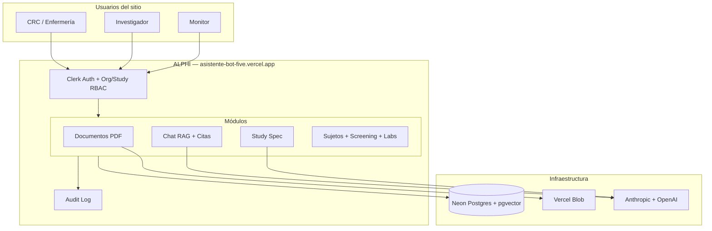
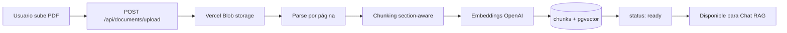
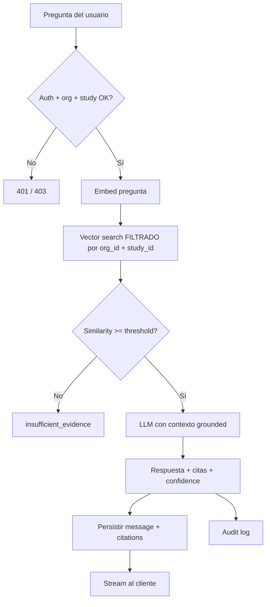
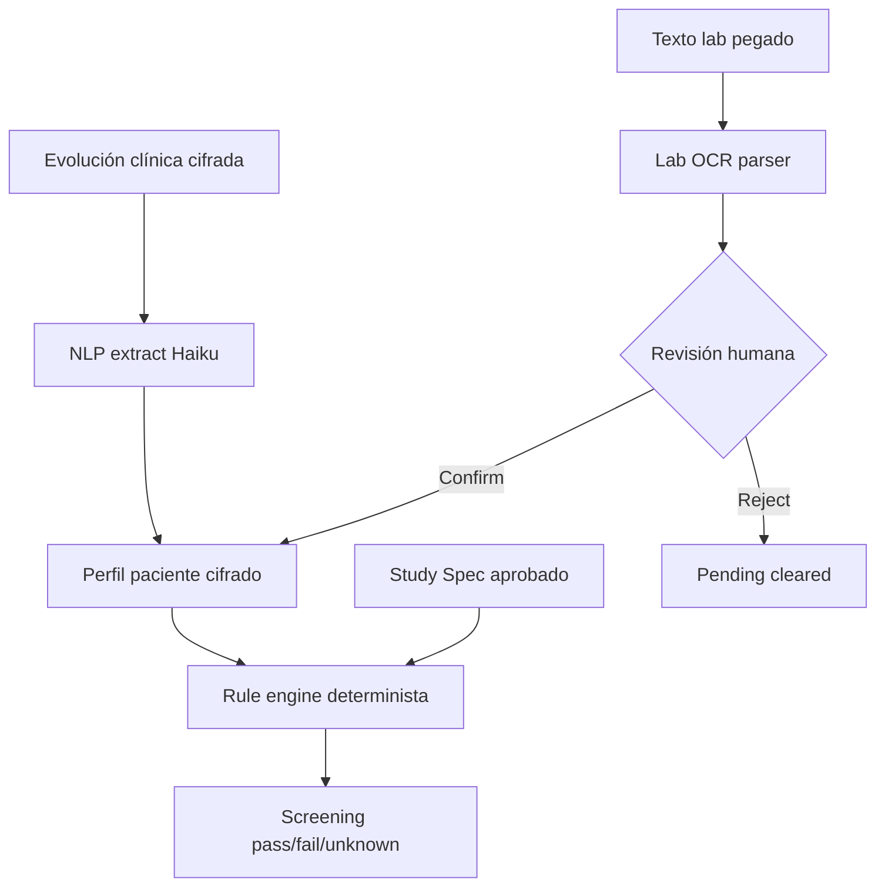
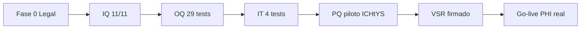

# ALPHI — Informe ejecutivo para accionistas

**Producto comercial:** ALPHI  
**Nombre técnico / repositorio:** Ichtys Clinical Document Assistant  
**Organización:** ICHtYS TECHNOLOGY SA  
**Fecha del informe:** 4 de julio de 2026  
**Clasificación:** Confidencial — uso interno y accionistas  
**Contacto:** sisbert@cinme.com.ar  

**Producción:** https://asistente-bot-five.vercel.app  
**Repositorio:** github.com/Santiagoisper/Asistente_bot (monorepo, carpeta `ichtys/`)

---

## Índice

1. [Resumen ejecutivo](#1-resumen-ejecutivo)
2. [Qué es ALPHI](#2-qué-es-alphi)
3. [La idea y la oportunidad](#3-la-idea-y-la-oportunidad)
4. [Qué construimos — visión de producto](#4-qué-construimos--visión-de-producto)
5. [Qué construimos — visión de ingeniería](#5-qué-construimos--visión-de-ingeniería)
6. [Diferenciación frente a la competencia global](#6-diferenciación-frente-a-la-competencia-global)
7. [Dónde estamos parados hoy](#7-dónde-estamos-parados-hoy)
8. [Cómo funciona ALPHI — flujogramas](#8-cómo-funciona-alphi--flujogramas)
9. [Guía de demostración paso a paso (links en vivo)](#9-guía-de-demostración-paso-a-paso-links-en-vivo)
10. [Evidencia técnica y métricas](#10-evidencia-técnica-y-métricas)
11. [Modelo de negocio](#11-modelo-de-negocio)
12. [Roadmap y próximos hitos](#12-roadmap-y-próximos-hitos)
13. [Riesgos y mitigaciones](#13-riesgos-y-mitigaciones)
14. [Anexos y documentación de soporte](#14-anexos-y-documentación-de-soporte)

---

## 1. Resumen ejecutivo

**ALPHI** es un asistente documental clínico con inteligencia artificial, diseñado para **sitios de ensayo clínico** (CRC, enfermería, investigadores, monitores). Responde preguntas operacionales sobre protocolos, Investigator Brochures y manuales de **200–400 páginas**, con **citas obligatorias** al documento fuente. Si no hay evidencia suficiente, **no responde** — no inventa.

### Mensaje central para accionistas

| Dimensión | Estado julio 2026 |
|-----------|-----------------|
| **Producto MVP** | ✅ Funcional en producción |
| **Diferenciador técnico** | Grounding-only + aislamiento multi-tenant + audit trail |
| **Compliance Fase 0** | ✅ Cerrada (DPA, DPIA, HIPAA, 13+ políticas) |
| **Validación CSV (Part 11)** | 🟡 ~70 % — IQ/OQ/IT PASS; PQ piloto pendiente |
| **Certificaciones ISO** | 🔴 ISMS lite; sin auditor externo aún |
| **Ingresos** | Pre-revenue; piloto interno ICHtYS en preparación |
| **Go-live PHI real** | Bloqueado hasta PQ + VSR firmado |

> **En una frase:** Construimos el producto difícil (trial-ops regulado), no el producto fácil (chat genérico sobre PDFs). El código está; falta cerrar validación en sitio y escalar comercialmente.

---

## 2. Qué es ALPHI

### Definición

ALPHI es una **plataforma web multi-tenant B2B** que combina:

1. **Chat RAG documental** — preguntas en lenguaje natural con respuestas ancladas a documentos del ensayo y citas clickeables.
2. **Extracción estructurada del protocolo (Study Spec)** — criterios de inclusión/exclusión, visitas, endpoints, medicación permitida/prohibida.
3. **Módulo clínico de sujetos (PHI-ready)** — evoluciones cifradas, perfil del paciente, screening determinista, OCR de laboratorios con revisión humana.

### Usuarios objetivo

| Rol | Uso principal |
|-----|---------------|
| CRC / Research Nurse | Elegibilidad, visitas, labs, medicación en sala |
| PI / Sub-I | Verificación rápida con evidencia trazable |
| Monitor / CRA | Validar que las respuestas tienen fuente auditable |
| Sponsor / Admin | Gobernanza multi-estudio, configuración, métricas |

### Qué NO es ALPHI

- No es un CTMS completo (Medidata, Veeva, etc.).
- No es un generador de epicrisis para consultorio (Pacientry, etc.).
- No es ChatGPT sobre PDFs sin trazabilidad.
- No está certificado FDA Part 11 ni ISO 27001 (aún).

---

## 3. La idea y la oportunidad

### El problema

Los equipos de sitio pierden **tiempo crítico** buscando en documentos fragmentados durante operaciones en vivo:

- Paciente en sala → la coordinadora no puede salir 15 minutos a buscar en el PDF.
- Monitor pide **evidencia trazable** de una decisión operacional.
- Staff nuevo en onboarding de un estudio complejo.
- Evento adverso → verificar timeline de reporte SAE/SUSAR en minutos.

### Nuestra tesis

> **La fuente trazable es el producto, no el chat.**

Competidores optimizan velocidad de salida al mercado con términos “experimentales”. ALPHI invierte en **profundidad regulada** antes de escala: tenant isolation, audit trail, validación CSV, contratos BAA/DPA con procesadores, rule engine determinista para screening.

### Oportunidad de mercado

- **LATAM cardiometabólico** como beachhead (estudios T2D, obesidad, MASH).
- Buyer B2B: sponsor, CRO, red de sitios — contrato por estudio/sitio, no por usuario suelto.
- Barrera de entrada: replicar documentación + tests + contratos = **12–24 meses** para un entrante sin equipo QA/CSV.

### Referencia aspiracional

Peter the Protocol Reader (Care Access / Reify Health). ALPHI apunta a superar ese benchmark en precisión de citas, trazabilidad y profundidad clínica para el mercado LATAM.

---

## 4. Qué construimos — visión de producto

### Tres pilares del producto

```
┌─────────────────────────────────────────────────────────────────┐
│                        ALPHI — Plataforma                        │
├─────────────────┬─────────────────────┬─────────────────────────┤
│  1. CHAT RAG    │  2. STUDY SPEC      │  3. MÓDULO CLÍNICO     │
│  Preguntas con  │  Protocolo →        │  Sujetos, evoluciones,  │
│  citas exactas  │  estructura machine │  screening, labs OCR    │
│  sobre docs     │  readable + diff    │  (PHI cifrado)          │
└─────────────────┴─────────────────────┴─────────────────────────┘
```

### Funcionalidades entregadas (MVP en producción)

| Módulo | Capacidad | Estado |
|--------|-----------|--------|
| Multi-tenant | Organizaciones → estudios → documentos (Clerk Orgs) | ✅ Prod |
| Upload PDF | Hasta 50 MB; parsing por página; chunking + embeddings | ✅ Prod |
| Chat grounded | Respuesta + citas + confidence; sin evidencia → abstención | ✅ Prod |
| Visor de citas | Navegación a página exacta del documento fuente | ✅ Prod |
| Study Spec | Extracción IA + aprobación humana + export + diff versiones | ✅ Prod |
| Screening | Rule engine determinista vs spec aprobado (pass/fail/unknown) | ✅ Prod |
| Sujetos clínicos | CRUD pseudonimizado, evoluciones cifradas AES-256-GCM | ✅ Prod |
| Labs OCR | Extract → revisión humana → confirm/reject | ✅ Prod |
| Audit trail | Log append-only de acciones (sin PHI en metadata) | ✅ Prod |
| Admin RAG | Config threshold/topK por organización en `/settings` | ✅ Prod |
| Cron recovery | Recuperación automática de documentos stuck | ✅ Prod |
| Trust / Legal | Trust center, pricing, ROI, privacy, terms | ✅ Prod |

### Contrato de producto (no negociable)

1. **Grounding-only** — solo responde desde documentos cargados del estudio activo.
2. **Citas obligatorias** — cada afirmación relevante lleva referencia verificable.
3. **LLM extrae, reglas deciden** — el modelo no es juez de elegibilidad final.
4. **Human-in-the-loop** — spec, OCR labs e inclusiones críticas requieren confirmación humana.
5. **Fail safe** — `unknown` / `insufficient_evidence` > falso positivo.

---

## 5. Qué construimos — visión de ingeniería

### Stack tecnológico

| Capa | Tecnología |
|------|------------|
| Frontend | Next.js 15 App Router, TypeScript, Tailwind |
| Auth / multi-tenant | Clerk Organizations + RBAC |
| Base de datos | Neon Postgres serverless + pgvector |
| Almacenamiento | Vercel Blob (PDFs privados) |
| IA | Anthropic Claude (chat/extracción) + OpenAI embeddings |
| Hosting / CI | Vercel + GitHub Actions + Turborepo/pnpm |
| Cifrado PHI | `@ichtys/crypto` — AES-256-GCM field-level |

### Arquitectura de paquetes (monorepo)

```
ichtys/
├── apps/web/          → Aplicación Next.js (UI + API routes)
├── packages/
│   ├── db/            → Schema Drizzle, migraciones Neon
│   ├── rag/           → Retrieval, answer engine, annotator
│   ├── ingestion/     → PDF parse, chunk, embed, spec extractor
│   ├── clinical/      → Screening engine, lab OCR parser, PHI redact
│   ├── crypto/        → Cifrado field-level PHI
│   ├── auth/          → validateStudyAccess, tenant isolation
│   └── evals/         → Suite de evaluación RAG (SM-001..012)
└── docs/compliance/   → 13+ políticas + CSV + FMEA + PQ + VSR
```

### Qué intentamos lograr programando (decisiones de diseño)

| Decisión | Por qué |
|----------|---------|
| Aislamiento org+study **antes** del vector search | Un bug de leakage es catastrófico en ensayos |
| Pipeline de ingestion explícito (sin orquestador opaco) | Debuggeable, validable, auditable |
| Rule engine determinista para screening | Part 11 exige reproducibilidad; LLM no decide |
| Cifrado field-level en evoluciones y perfiles | HIPAA/GDPR at-rest en DB compartida |
| Gate unificado `validate:product` | 7 checks en un comando — evidencia CSV repetible |
| 29 tests OQ en CI | Cada push valida módulo clínico automáticamente |
| Pre-redacción antes de enviar texto a LLM | DNI, email, teléfono nunca salen al proveedor |
| Zero-retention en APIs de IA | BAA con Anthropic/OpenAI; no training on customer data |

### Qué intentamos lograr como software (experiencia)

| Job to be done | Cómo lo resuelve ALPHI |
|----------------|------------------------|
| Elegibilidad en screening | Chat cita § inclusión + módulo screening determinista |
| Pre-visita | Pregunta “¿procedimientos visita 4?” → cita Schedule of Assessments |
| Medicación prohibida | Cita § Concomitant/Prohibited Medication |
| Labs y muestras | Cita Lab Manual + OCR labs con confirmación humana |
| Safety reporting | Cita timelines SAE/SUSAR del protocolo |
| Preparación monitor | Historial + citas + export spec |

---

## 6. Diferenciación frente a la competencia global

### Mapa competitivo

| | **Pacientry** | **ALPHI** | **CTMS clásico** | **ChatGPT / Copilot** |
|---|---------------|-----------|------------------|----------------------|
| **Qué hace** | Epicrisis, CIE-11, OCR médico general | RAG + citas sobre docs de ensayo + screening | Operaciones trial end-to-end | Chat genérico |
| **Buyer** | Médico individual | Sponsor / CRO / red | Enterprise pharma | Cualquiera |
| **Regulación** | ToS “experimental” | Framework CSV + compliance real | Part 11 maduro | Sin compliance clínico |
| **Trazabilidad** | Baja | Citas obligatorias + audit trail | Alta (pero rígido/caro) | Ninguna |
| **Precio** | ~USD 0.59/epicrisis | B2B por estudio/sitio | Enterprise six-figure | USD 20/mes |
| **Time-to-value** | Minutos (self-serve) | Semanas (piloto + validación) | Meses (implementación) | Instantáneo (inútil en GCP) |

### Por qué ALPHI es diferente (foso)

1. **Grounding-only como contrato de producto**, no como marketing — verificable con eval suite SM-001..012.
2. **13+ políticas de compliance** + implementación técnica (cifrado, audit, leakage tests).
3. **BAAs/DPA firmados** con Neon, Vercel, Clerk, Anthropic, OpenAI, Upstash **antes** de PHI real.
4. **Validación CSV en curso** con trazabilidad URS → FRS → tests (RTM v1.0).
5. **Barrera regulatoria** — un competidor self-serve tarda años en replicar sin equipo QA/CSV dedicado.

### Qué NO copiamos (a propósito)

- Disclaimer “experimental / declinamos responsabilidad clínica” (Pacientry).
- Diagnósticos diferenciales generativos sin evidencia.
- Claims inflados de certificación Part 11 o ISO.

---

## 7. Dónde estamos parados hoy

### Posición global del programa

```
Etapa 0  Producto MVP           ████████████████████  CERRADA
Etapa 1  Legal pre-PHI          ██████████████████░░  CERRADA (04-jul-2026)
Etapa 2  Validación CSV         ██████████████░░░░░░  EN CURSO (~70 %)
Etapa 3  Go-live PHI piloto      ░░░░░░░░░░░░░░░░░░░░  PENDIENTE
Etapa 4  Escala + ISO formal     ░░░░░░░░░░░░░░░░░░░░  ROADMAP 2026–2027
```

### Por marco regulatorio

| Marco | ¿Certificado? | Madurez estimada | Próximo hito |
|-------|---------------|------------------|--------------|
| FDA 21 CFR Part 11 | No | ~70 % CSV | PQ piloto + VSR |
| EMA Annex 11 | No | ~65 % | Igual que Part 11 |
| ICH E6 GCP | N/A | ~60 % alineación producto | Capacitación sitio |
| GDPR | No (no existe sello) | ~80 % docs | Asignar DPO |
| HIPAA | No | ~75 % docs/contratos | Security Officer |
| ISO 27001 | No | ~35 % | SOC 2 readiness Q4 2026 |
| ISO 27701 | No | ~25 % | Extensión 2027 |
| ISO 42001 | No | ~30 % lite | Post-27001 |

### Evidencia verificable (julio 2026)

| Gate | Resultado |
|------|-----------|
| `validate:product` | **7/7 OK** |
| OQ tests | **29/29 PASS** (CI) |
| IT PHI | **4/4 PASS** |
| IQ prod | **11/11 OK** |
| Eval RAG SM-001..012 | **12/12 PASS** |
| Leakage cross-tenant | **0 fallos** |
| Smoke PHI prod | create + delete OK |

*Detalle completo:* `docs/audits/ALPHI_FULL_AUDIT_2026-07-04.md`  
*Posición regulatoria:* `docs/compliance/REGULATORY-POSITION-SHAREHOLDERS.md`

---

## 8. Cómo funciona ALPHI — flujogramas

### 8.1 Flujo general de la plataforma



### 8.2 Pipeline de ingesta de documentos



### 8.3 Pipeline RAG (chat con citas)



### 8.4 Flujo clínico — screening y labs



### 8.5 Flujo de validación CSV (programa compliance)



---

## 9. Guía de demostración paso a paso (links en vivo)

**URL base:** https://asistente-bot-five.vercel.app  
**Estudio demo:** MOCK-METABOLIC-T2D-v1  
**UUID estudio:** `508fa9c9-dbb9-49aa-abd5-7f7fe968bbc6`  
**Organización demo:** INNOVA TRIALS  

> Todos los documentos del demo son **ficticios, sin PHI real**. Ideal para mostrar a accionistas sin riesgo de privacidad.

---

### Fase A — Superficie pública (sin login) · ~5 minutos

Mostrar que ALPHI tiene **presencia comercial y compliance visible** — algo que muchos competidores técnicos no tienen.

| Paso | Qué mostrar | URL |
|------|-------------|-----|
| A1 | Landing — propuesta de valor | https://asistente-bot-five.vercel.app |
| A2 | **Trust Center** — procesadores, cifrado, políticas | https://asistente-bot-five.vercel.app/trust |
| A3 | **Pricing** — modelo por estudio/sitio | https://asistente-bot-five.vercel.app/pricing |
| A4 | **Calculadora ROI** — ahorro operacional estimado | https://asistente-bot-five.vercel.app/roi |
| A5 | **Privacidad** | https://asistente-bot-five.vercel.app/privacy |
| A6 | **Términos de uso** | https://asistente-bot-five.vercel.app/terms |

**Narrativa sugerida:** “No somos un wrapper de ChatGPT. Tenemos trust center, pricing y marco legal antes de escala.”

---

### Fase B — Acceso y dashboard · ~2 minutos

| Paso | Qué mostrar | URL |
|------|-------------|-----|
| B1 | Login (Clerk) | https://asistente-bot-five.vercel.app/sign-in |
| B2 | Dashboard post-login | https://asistente-bot-five.vercel.app/dashboard |
| B3 | Lista de estudios | https://asistente-bot-five.vercel.app/studies |

**Credenciales:** usar cuenta demo INNOVA TRIALS (proporcionar al presentador antes de la reunión).

---

### Fase C — Estudio mock T2D — corazón del producto · ~15 minutos

**URL base del estudio:**  
https://asistente-bot-five.vercel.app/studies/508fa9c9-dbb9-49aa-abd5-7f7fe968bbc6

| Paso | Módulo | URL | Qué demostrar |
|------|--------|-----|---------------|
| C1 | **Documentos** | `/studies/508fa9c9-dbb9-49aa-abd5-7f7fe968bbc6/documents` | 5 PDFs mock cargados (Protocolo, IB, Lab, Pharmacy, Procedures); status `ready` |
| C2 | **Chat RAG** | `/studies/508fa9c9-dbb9-49aa-abd5-7f7fe968bbc6/chat` | Preguntas con citas — ver script abajo |
| C3 | **Study Spec** | `/studies/508fa9c9-dbb9-49aa-abd5-7f7fe968bbc6/spec` | Criterios extraídos, visitas, endpoints; spec aprobado |
| C4 | **Historial** | `/studies/508fa9c9-dbb9-49aa-abd5-7f7fe968bbc6/history` | Conversaciones previas auditables |
| C5 | **Sujetos** | `/studies/508fa9c9-dbb9-49aa-abd5-7f7fe968bbc6/subjects` | Lista de sujetos pseudonimizados |
| C6 | **Detalle sujeto** | `/studies/508fa9c9-dbb9-49aa-abd5-7f7fe968bbc6/subjects/{subjectId}` | Evolución, perfil, screening, labs OCR |
| C7 | **Biblioteca** | https://asistente-bot-five.vercel.app/library | Vista transversal de documentos |
| C8 | **Settings RAG** | https://asistente-bot-five.vercel.app/settings | Threshold y topK configurables por org |
| C9 | **Import bulk** | https://asistente-bot-five.vercel.app/studies/import | Importación masiva de estudios (admin) |

---

### Fase D — Script de 6 preguntas para el chat (copy-paste)

Abrir **C2 — Chat** y pegar cada pregunta. Mostrar siempre el **botón de cita** y la página fuente.

| # | Pregunta | Resultado esperado |
|---|----------|-------------------|
| 1 | `¿Un paciente con HbA1c de 9% cumple criterio de inclusión?` | Cita §3.1 Inclusion; rango 7–10% |
| 2 | `¿Está excluido un paciente con antecedente de pancreatitis?` | Cita §3.2 Exclusion; sí excluido |
| 3 | `¿Qué procedimientos corresponden en la visita 4?` | Cita §3.3 Schedule of Assessments |
| 4 | `¿Cuál es la ventana permitida para la visita de seguimiento?` | Cita §3.4 Visit Windows; V6 ±7 días |
| 5 | `¿Está permitida metformina durante el estudio?` | Cita §3.5 Concomitant Medication |
| 6 | `¿Qué medicamentos antidiabéticos están prohibidos?` | Cita §3.6 Prohibited Medication |

**Pregunta adversarial (grounding-only):**

| # | Pregunta | Resultado esperado |
|---|----------|-------------------|
| 7 | `¿Cuál es la dosis recomendada de warfarina para este estudio?` | `insufficient_evidence` — **no inventar** |

---

### Fase E — Módulo clínico (opcional, si hay sujeto demo) · ~5 minutos

En detalle de sujeto (`/subjects/{id}`):

1. **Evolución** — guardar texto con HbA1c 8.2%; mostrar que perfil se actualiza.
2. **Screening** — assessments pass/fail/unknown coherentes con spec.
3. **Labs OCR** — pegar texto de lab → extract → confirmar o rechazar.

**Narrativa:** “El LLM extrae datos; las reglas deterministas deciden elegibilidad. Humano confirma labs.”

---

### Fase F — Cierre con compliance · ~3 minutos

| Paso | Qué decir | Referencia |
|------|-----------|------------|
| F1 | “Fase 0 legal cerrada; BAAs firmados” | Trust Center + DPA tracker interno |
| F2 | “29 tests OQ automatizados en cada deploy” | CI GitHub |
| F3 | “Próximo paso: PQ con 5 usuarios ICHtYS” | `docs/compliance/PQ.md` |
| F4 | “No decimos certificado Part 11 — decimos validación en progreso” | Honestidad = confianza inversor |

---

### Checklist pre-demo (5 minutos antes)

- [ ] Login funciona en org INNOVA TRIALS
- [ ] Estudio MOCK-METABOLIC visible en `/studies`
- [ ] Chat responde en < 5 segundos
- [ ] No hay datos reales de pacientes en pantalla
- [ ] Plan B: video grabado si falla conexión

---

## 10. Evidencia técnica y métricas

### Gates automatizados

| Métrica | Target | Estado actual |
|---------|--------|---------------|
| validate:product | 7/7 OK | ✅ PASS |
| OQ tests | 29/29 | ✅ PASS |
| IT PHI | 4/4 | ✅ PASS |
| IQ prod | 11/11 | ✅ PASS |
| Eval RAG SM-001..012 | 12/12 | ✅ PASS |
| Leakage cross-study/org | 0% | ✅ PASS (bloqueante) |
| Citation correctness | > 90% | ✅ En eval interna |
| Latencia P90 chat | < 4 s | ✅ Target operacional |

### Documentación de compliance (13+ políticas)

Ubicación: `ichtys/docs/compliance/`

| Documento | Propósito |
|-----------|-----------|
| DATA-CLASSIFICATION | Clasificación D1–D7 |
| PHI-HANDLING-POLICY | Manejo ALCOA+ |
| PSEUDONYMIZATION-POLICY | Pseudónimos sujetos |
| ACCESS-CONTROL-POLICY | RBAC + segregación |
| DATA-RETENTION-POLICY | Retención GCP/GDPR |
| BREACH-NOTIFICATION-PROCEDURE | 72h GDPR / 60d HIPAA |
| BACKUP-AND-DR | Continuidad Neon PITR |
| AI-GOVERNANCE | ISO 42001 lite |
| ISMS-OVERVIEW | ISO 27001 lite |
| CSV-VALIDATION-PLAN | GAMP 5 / Part 11 |
| DPIA | GDPR Art. 35 |
| HIPAA-RISK-ASSESSMENT | Security Rule |
| DPA-BAA-TRACKER | Contratos procesadores |
| URS / FRS / RTM v1.0 | Trazabilidad requisitos |
| FMEA / PQ / VSR | Validación formal |

---

## 11. Modelo de negocio

### Unidad de valor

- **Por estudio activo** o **por sitio/red** — no por usuario individual.
- Buyer: sponsor, CRO, red de centros de investigación.

### Etapas comerciales

| Etapa | Oferta | Estado |
|-------|--------|--------|
| Demo | Estudio mock T2D gratuito (trust + chat) | ✅ Disponible |
| Piloto | 1 sitio, N estudios, soporte CSV | 🟡 ICHtYS en preparación |
| Enterprise | Multi-sitio, DPA/BAA, SLA, validación completa | 🔴 Post-PQ |

### Pricing público

Ver: https://asistente-bot-five.vercel.app/pricing  
Calculadora ROI: https://asistente-bot-five.vercel.app/roi

**Estado:** Pre-revenue. Pricing indicativo publicado; contratos enterprise por negociación.

---

## 12. Roadmap y próximos hitos

| Hito | Timeline estimado | Prerequisito |
|------|-------------------|--------------|
| PQ piloto ICHtYS (5 usuarios) | Q3 2026 | Usuarios disponibles |
| VSR firmado | Post-PQ | Quality + Clinical + Security |
| Go-live PHI real (1 sitio) | Q3–Q4 2026 | VSR |
| SOC 2 Type I readiness | Q4 2026 | Roles ISMS asignados |
| ISO 27001 gap assessment | H1 2027 | SOC 2 |
| Multi-sitio / billing | 2027 | Go-live piloto exitoso |

### Uso de capital (orientativo)

1. Cerrar validación CSV + PQ + roles compliance
2. Superficie GTM (demo, trust, primer piloto pagado)
3. OCR PDF escaneado (Reducto/Azure DI) para protocolos reales
4. Primer contrato sponsor LATAM cardiometabólico

---

## 13. Riesgos y mitigaciones

| Riesgo | Impacto | Mitigación |
|--------|---------|------------|
| Retraso PQ por usuarios piloto | Alto | Protocolo listo; agendar ventana piloto ICHtYS |
| Due diligence exige ISO certificado | Medio | Roadmap SOC2/ISO; ISMS lite hoy |
| Competidor “AI for trials” sin CSV | Medio | Foso = profundidad regulada |
| Breach PHI | Crítico | Sin PHI real hasta VSR; cifrado + leakage tests |
| Trust page desactualizado vs DPA firmados | Bajo | Actualizar copy en próximo sprint |

---

## 14. Anexos y documentación de soporte

### Documentos clave en el repositorio

| Documento | Ruta |
|-----------|------|
| Este informe | `docs/pitch/ALPHI-SHAREHOLDER-REPORT-2026.md` |
| Posición regulatoria | `docs/compliance/REGULATORY-POSITION-SHAREHOLDERS.md` |
| Auditoría jul 2026 | `docs/audits/ALPHI_FULL_AUDIT_2026-07-04.md` |
| Roadmap programa | `docs/ROADMAP.md` |
| PRD producto | `docs/PRD.md` |
| Arquitectura técnica | `docs/ARCHITECTURE.md` |
| Script demo inversores | `docs/evals/demo-script.md` |
| Pitch deck (slides) | `docs/pitch/deck.md` |
| Compliance one-pager | `docs/pitch/compliance-one-pager.md` |
| Plan CSV | `docs/compliance/CSV-VALIDATION-PLAN.md` |
| PQ protocolo | `docs/compliance/PQ.md` |
| VSR borrador | `docs/compliance/VSR.md` |

### Links externos

| Recurso | URL |
|---------|-----|
| Producción | https://asistente-bot-five.vercel.app |
| Trust Center | https://asistente-bot-five.vercel.app/trust |
| GitHub Actions CI | https://github.com/Santiagoisper/Asistente_bot/actions |
| Contacto | sisbert@cinme.com.ar |

---

## Declaración de exactitud

Este informe refleja el estado del producto y del programa de compliance al **4 de julio de 2026**, basado en evidencia del repositorio, auditoría automatizada y documentación interna. ALPHI **no está certificado** bajo FDA Part 11, EMA Annex 11 ni ISO 27001/27701/42001. Las afirmaciones de cumplimiento se refieren a **alineación documental y controles técnicos verificables**, no a certificación formal.

---

## Aprobación

| Rol | Nombre | Fecha | Firma |
|-----|--------|-------|-------|
| CEO | Nicolás Daguerre | | |
| Desarrollador | Santiago Isbert | | |
| Directorio / Accionistas | | | |

---

*ALPHI · ICHtYS TECHNOLOGY SA · Julio 2026*
